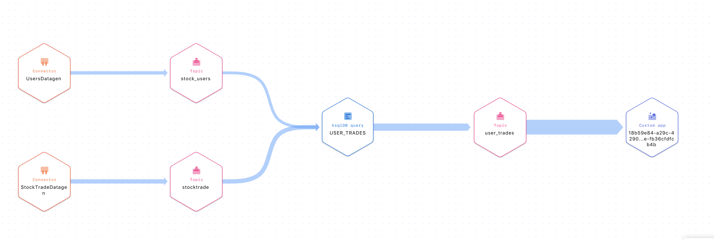
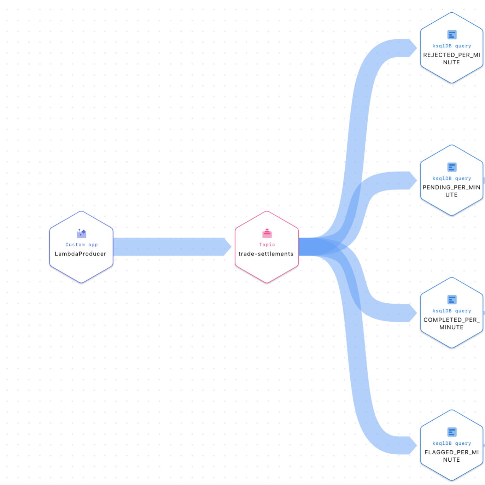

# Confluent Cloud Lambda Serverless Integration

### Prerequisites
* Java 11 (*_NOTE_* this is the latest version of Java supported by the AWS Lambda)
* Gradle 7.0
* jq
* A user account in [Confluent Cloud](https://www.confluent.io/confluent-cloud/tryfree/)
* Local installation of [Confluent CLI](https://docs.confluent.io/confluent-cli/current/install.html) v2.10.0 or later

For the AWS portion of the sample code you'll need
* A user account in [AWS](https://aws.amazon.com/)
* Local installation of [AWS CLI](https://aws.amazon.com/cli/) version 2.4 or later

For the Azure section you'll need the following
* [.NET version 6.0](https://dotnet.microsoft.com/en-us/download) 
* A user account on [Azure](https://azure.microsoft.com/en-us/free/) and then create [a subscription](https://docs.microsoft.com/en-us/azure/cost-management-billing/manage/create-subscription#create-a-subscription-in-the-azure-portal)
* Local installation of the [Azure CLI](https://docs.microsoft.com/en-us/cli/azure/install-azure-cli) version v2.36 or later


### Setup

To run this demo, you'll need a Kafka cluster, a ksqlDB application and two datagen source connectors.  The source connectors will generate two event streams that the ksqlDB will join and write
out to a topic, `user_trades`.  Then an AWS Lambda or Azure Function, using the `user_trades` as an event source will take some additional action and produce results back to the Kafka cluster in Confluent Cloud.
Using a lambda in this way is a proxy for a User Defined Function (UDF) with ksqlDB in Confluent Cloud.

But before you run the demo, you'll need to set up some resources on Confluent Cloud and AWS or Azure.  We've provided some scripts in this repository to keep the amount of work you need to do at a minimum.

The following sections provide details for setting up a cluster on Confluent Cloud and creating an AWS Lambda to process events from ksqlDB

### Provisioning a Kafka Cluster, ksqlDB application, and datagen source connectors

**_NOTE:_** This part assumes you have already set up an account on [Confluent Cloud](https://confluent.cloud/) and you've installed the [Confluent CLI](https://docs.confluent.io/confluent-cli/current/install.html).

To create the Kafka cluster, ksqlDB application, and the datagen sink connectors you'll run a command from the base directory of this repository
If you're running the AWS example you'll run:
```shell
 ./ccloud-build-app.sh
```
And if you're going to use Azure you'll run this command:
```shell
./ccloud-build-app-azure.sh
```
     
This script relies on the open source library [ccloud_library.sh](https://github.com/confluentinc/examples/blob/latest/utils/ccloud_library.sh), and will download it the first time you run the command.

The [ccloud-build-app](ccloud-build-app.sh) script performs several tasks which I'll highlight here. If you want to skip the details, once the script complete the next step you'll need to take the steps outlined in either the [Creating the AWS Lambda](#create-the-aws-lambda) or the [Creating the Azure Function](#create-the-azure-function) sections.

**_NB: The script performs these steps, the details are here for you to follow along with what's happening while it runs_**

1. It creates a Kafka cluster (with the required ACLs) and a ksqlDB application on Confluent Cloud.  The script waits for the brokers and the ksqlDB application to be in a runnable state before moving on.
Note that the amount of time for the ksqlDB application to get in a runnable state takes a few minutes, but the script will provide the status.
   1. When the cluster is running you'll see some output like this
     ```shell
            ....
            +------------------+------------+------------------+----------+---------------+---------+
            User:312125      | ALLOW      | IDEMPOTENT_WRITE | CLUSTER  | kafka-cluster | LITERAL
            ServiceAccountId | Permission | Operation | Resource |     Name      |  Type
            +------------------+------------+-----------+----------+---------------+---------+
            User:312125      | ALLOW      | DESCRIBE  | CLUSTER  | kafka-cluster | LITERAL
            Set API Key "JOMV3TUYDUP4JKWX" as the active API key for "lkc-jd17p".

            Client configuration file saved to: stack-configs/java-service-account-sa-xxxxxx.config

      ```
      The `java-service-account-sa-xxxxxx` configuration file contains the credentials created during the cluster and ksqlDB creation process.  You won't have to work with it directly, but the remaining stages of the `ccloud-build-app` script will use it in subsequent steps, that we'll cover soon.
2. Next, the script will wait for the ksqlDB application to come online, you'll see something like this
   ```shell
      Now waiting up to 720 seconds for the ksqlDB cluster to be UP
   ```
    Once ksqlDB is operational you'll see this line in the console
    ```shell
     Successfully created ksqlDB
    ```  
3. Then the script creates the required topics.  This part goes quickly, and you'll see something similar to this in the console:
    ```shell
      Now creating topics
      Created topic "stocktrade".
      Created topic "users".
      Created topic "user_trades".
      Created topic "trade-settlements".
    ```  
4. The next step the script performs is to create JSON files needed to create datagen connectors on Confluent Cloud and a JSON file for setting up connection credentials so the AWS Lambda 
can use the `user_trades` topic as an event source and produce back to Kafka.  
To create the files, the script executes a [custom task, propsToJson](https://github.com/confluentinc/CCloud-Serverless-Integration/blob/main/build.gradle#L95-L145)
file. 
 The specific files created (ignored by the repository) are
   1. `src/main/resources/stocktrade-dategen.json`
   2. `src/main/resources/user-datagen.json`
   3. `aws-cli/aws-ccloud-creds.json`
 
   You'll see something like this on the console for this step
   ```shell
    Now generating JSON properties needed for creating datagen connectors and AWS secrets manager
    For this the script is using custom gradle task 'propsToJson'
    The JSON properties for the datagen connectors are
    src/main/resources/stocktrade-datagen.json
    src/main/resources/user-datagen.json
    The JSON file for AWS securitymanager is aws-cli/aws-ccloud-creds.json

    BUILD SUCCESSFUL in 929ms
   ```   
   
5. Next the script create the datagen source connectors which create the event streams which drives the demo, you'll see something like this:
   ```shell
    Now creating the stocktrade datagen connector
    Created connector StockTradeDatagen lcc-wq805
    Now creating the user datagen connector
    Created connector UsersDatagen lcc-kd72g
   ```
    The script waits here until both connectors are in a running state:
   ```shell
     Connector src/main/resources/stocktrade-datagen.json (StockTradeDatagen) is RUNNING
     Connector src/main/resources/user-datagen.json (UsersDatagen) is RUNNING
    ```  
6. The final step the script performs is to upload [the sql statements](src/main/resources/stocktrade-statements.sql) for ksqlDB to execute and the following appears on the console
   <details>
   <summary>Click to view sql statements upload results</summary>
   
   ```shell
    Submit KSQL queries for running the AWS Lambda demo from src/main/resources/stocktrade-statements.sql
    CREATE STREAM STOCKTRADE (side varchar,quantity int,symbol varchar,price int,account varchar,userid varchar) with (kafka_topic = 'stocktrade',value_format = 'json');
    [{"@type":"currentStatus","statementText":"CREATE STREAM STOCKTRADE (SIDE STRING, QUANTITY INTEGER, SYMBOL STRING, PRICE INTEGER, ACCOUNT STRING, USERID STRING) WITH (KAFKA_TOPIC='stocktrade', KEY_FORMAT='KAFKA', VALUE_FORMAT='JSON');","commandId":"stream/`STOCKTRADE`/create","commandStatus":{"status":"SUCCESS","message":"Stream created","queryId":null},"commandSequenceNumber":2,"warnings":[]}]

    CREATE TABLE users (userid varchar primary key, registertime BIGINT, regionid varchar ) with ( kafka_topic = 'users', value_format = 'json');
    [{"@type":"currentStatus","statementText":"CREATE TABLE users (USERID STRING PRIMARY KEY, REGISTERTIME BIGINT, REGIONID STRING) WITH (KAFKA_TOPIC='users', KEY_FORMAT='KAFKA', VALUE_FORMAT='JSON');","commandId":"table/`users`/create","commandStatus":{"status":"SUCCESS","message":"Table created","queryId":null},"commandSequenceNumber":4,"warnings":[]}]

    CREATE STREAM USER_TRADES WITH (kafka_topic = 'user_trades' ) AS SELECT s.userid as USERID,u.regionid,quantity,symbol,price,account,side FROM STOCKTRADE s LEFT JOIN users u on s.USERID = u.userid;
    [{"@type":"currentStatus","statementText":"CREATE STREAM USER_TRADES WITH (KAFKA_TOPIC='user_trades', PARTITIONS=6, REPLICAS=3) AS SELECT\n  S.USERID USERID,\n  U.REGIONID REGIONID,\n  S.QUANTITY QUANTITY,\n  S.SYMBOL SYMBOL,\n  S.PRICE PRICE,\n  S.ACCOUNT ACCOUNT,\n  S.SIDE SIDE\nFROM STOCKTRADE S\nLEFT OUTER JOIN users U ON ((S.USERID = U.USERID))\nEMIT CHANGES;","commandId":"stream/`USER_TRADES`/create","commandStatus":{"status":"SUCCESS","message":"Created query with ID CSAS_USER_TRADES_5","queryId":"CSAS_USER_TRADES_5"},"commandSequenceNumber":6,"warnings":[]}]
   ``` 
   </details>
 
At this point, you'll have a running Kafka cluster, datagen connectors, and a ksqlDB application performing a join on the two generated event streams.  You can log into the Confluent Cloud Console
and click on `ksqlDB` on the left.  Then click on `Streams` -> `Query USER_TRADES` to observe the results.


### Create the AWS Lambda

To create the AWS Lambda it is assumed that you've already set up [local configuration for the AWS CLI](https://docs.aws.amazon.com/cli/latest/userguide/cli-configure-quickstart.html). 
Then you'll run a script which will set up all the AWS resources and create a Lambda instance for you.

1. In the `aws-cli` directory save the file [configs.orig.sh](aws-cli/configs.orig.sh) as `configs.sh`
```shell
 (cd aws-cli && cat configs.orig.sh > configs.sh )
```
The project will ignore the `configs.sh` file.  It's used to provide environment 
replacements needed for some AWS commands. Most of the variables are already set, but you'll need to update the `PROFILE` variable with the profile name to use, `default` if you are not sure.
Then update the `BOOTSTRAP_SERVERS` variable with the value contained in the `stack-configs/java-service-account-*.config` file you created in the previous step.  **IMPORTANT! The name for the credentials `CREDS_NAME="CCloudLambdaCredentials"` is hard coded in the Java Lambda code.  I realize this isn't ideal, and I'm working towards making this dynamic, but
in the meantime, DON'T CHANGE THIS VALUE**
 


2. From the root of the repository run 
```shell
 ./gradlew clean build buildZip 
````
3. Run the [aws-create-all](aws-cli/aws-create-all.sh) script in the `aws-cli` directory. Note that the script needs to be run from the `aws-cli` directory
  ```shell
  (cd aws-cli && ./aws-create-all.sh) 
   ````

> ✎ **NOTE:**  
> If the username on the account doesn't have sufficient permissions to perform any of the commands in the AWS script you'll get an error similar to this:
> 
> An error occurred (AccessDeniedException) when calling the XXXX operation: User: arn:aws:iam::829250931565:user/abcd 
> is not authorized to perform: xxxxxx:XXXXXX on resource: XXXXXX because no identity-based policy allows the xxxxxx:XXXXXX action
> 
> 
> To fix this issue you'll have to provide the user the sufficient permissions (maybe admin access) via IAM through the cli or UI


The script will prompt you to enter `y` or `n` to confirm your choice.  

4. The following AWS components get created:
   1. An AWS Secrets Manger with all the connection info to connect to Confluent Cloud
   2. An AWS Role with an attached policy with all the required permissions for the Lambda to execute properly
   3. Finally, an AWS Lambda instance with an event sources mapped to the Confluent Cloud topic `user_trades` which contains the results of the ksqlDB join

5. To confirm the lambda is working
   1. Run this command to view the events for the Lambda
   ```shell
    (cd aws-cli && ./read-latest-log-events.sh | less)
    ```
      If there isn't any output wait a few minutes and run it again.  Note this command only shows events from the latest log file.
   2. Go to the Confluent Cloud Console and click on the `Stream Lineage` link you should see something like this
    

### Create the Azure Function

For the Azure function, it is assumed that you've already configured the [Azure CLI tool](https://docs.microsoft.com/en-us/cli/azure/get-started-with-azure-cli).
Next you'll run a script which will set up all the required Azure resources and create an Azure Function application.  When you ran the  `ccloud-build-app-azure.sh` command, it also created all the configs required to build the Azure Function application.

1. Run the [azure-create-all.sh](azure-cli/azure-create-all.sh) script in the `azure-cli` directory.
  ```shell
  (cd azure-cli && ./azure-create-all.sh) 
   ````

The script will prompt you with a menu to choose the application type to create:
```shell
Select the application type to build
1) kafka-direct-trigger
2) sink-connector-trigger
#?
```
enter either `1` or `2` to proceed. 
The first choice builds an Azure Function that uses a topic on Confluent Cloud as an event source and the second menu option builds an application that requires you to use the [Azure Sink Connector](https://docs.confluent.io/cloud/current/connectors/cc-azure-functions-sink.html).  This README describes using option 1, the Kafka topic direct event trigger, but the steps for the sink function application are the same except enabling the sink connector on Confluent Cloud.
Note that using the first option on the menu creates an Azure Function on the [Azure Function Premium Plan](https://docs.microsoft.com/en-us/azure/azure-functions/functions-premium-plan?tabs=portal) which has a different pricing plan where costs accrue while the function application is deployed, regardless if it executes or not.

2. The script creates the following components on Azure
    1. A [Resource Group](https://docs.microsoft.com/en-us/azure/azure-resource-manager/management/manage-resource-groups-portal#what-is-a-resource-group) which is a container for related resources on Azure.
    2. An [Azure Storage account](https://docs.microsoft.com/en-us/azure/storage/common/storage-account-overview)
    3. [Key Vault](https://docs.microsoft.com/en-us/azure/key-vault/general/basic-concepts) instance used for storing the credentials necessary to connect to Confluent for running the application.  Note that the script handles getting all the configurations generated in the first step into the key vault automatically for you.
    4. Finally, the Azure Function application using the Confluent Cloud topic `user_trades` (which contains the results of the ksqlDB join) as an event source.

3. To confirm the Azure Function is working
    1. Run this command to view the events for the Azure Function:
   ```shell
    func azure functionapp logstream AzureKafkaDirectFunctionApp
    ```
    2. Go to the Confluent Cloud Console and click on the `Stream Lineage` link you should see something like this
       
   
### Run the ksqlDB queries to process Lambda/Azure Function results

Next you'll run a series of queries in the [lambda-processing-statements.sql](src/main/resources/lambda-processing-statements.sql) file so the ksqlDB application can provide some 
analysis of the results from the Lambda. 

To do this first CD back into the base directory of the repository.  
Then run the [ccloud-run-lambda-sql](ccloud-run-lambda-sql.sh) script from the root of the project

```shell
 ./ccloud-run-lambda-sql.sh
```
Then navigate back to the `Stream Lineage` section and from the selections at the bottom you should be able to another one that's shows the flow from the lambda to Confluent Cloud


The results of loading these sql statements will look like (details truncated for clarity)
<details>
<summary>Click to view sql statement upload results</summary>

```shell
 CREATE STREAM TRADE_SETTLEMENT (user varchar, symbol varchar, amount double, disposition varchar, reason varchar, timestamp BIGINT) with (kafka_topic = 'trade-settlements', value_format = 'PROTOBUF', timestamp = 'timestamp');
 [{"@type":"currentStatus","statementText":"CREATE STREAM TRADE_SETTLEMENT....

 CREATE TABLE COMPLETED_PER_MINUTE AS SELECT symbol, count(*) AS num_completed FROM TRADE_SETTLEMENT WINDOW TUMBLING (size 60 second) WHERE disposition like '%Completed%' GROUP BY symbol;
 [{"@type":"currentStatus","statementText":"CREATE TABLE COMPLETED_PER_MINUTE...

 CREATE TABLE PENDING_PER_MINUTE AS SELECT symbol, count(*) AS num_pending FROM TRADE_SETTLEMENT WINDOW TUMBLING (size 60 second) WHERE disposition like '%Pending%' GROUP BY symbol;
 [{"@type":"currentStatus","statementText":"CREATE TABLE PENDING_PER_MINUTE...

 CREATE TABLE FLAGGED_PER_MINUTE AS SELECT symbol, count(*) AS num_flagged FROM TRADE_SETTLEMENT WINDOW TUMBLING (size 60 second) WHERE disposition like '%SEC%' GROUP BY symbol;
 [{"@type":"currentStatus","statementText":"CREATE TABLE FLAGGED_PER_MINUTE...

 CREATE TABLE REJECTED_PER_MINUTE AS SELECT symbol, count(*) AS num_rejected FROM TRADE_SETTLEMENT WINDOW TUMBLING (size 60 second) WHERE disposition like '%Rejected%' GROUP BY symbol;
 [{"@type":"currentStatus","statementText":"CREATE TABLE REJECTED_PER_MINUTE...
 ```
</details>


### Clean Up

Since both the Confluent Cloud, AWS and Azure resources cost money, it's important to fully remove all components in the cloud environments.

#### Remove up all AWS resources
To remove all the AWS components you'll run the [aws-delete-all.sh](aws-cli/aws-delete-all.sh) script.
1. Run this commands to clean up the AWS components
    ```shell 
     (cd aws-cli && ./aws-delete-all.sh) 
    ```     

#### Remove up all Azure resources
To remove all the Azure components you'll run the [azure-delete-all.sh](azure-cli/azure-delete-all.sh) script. This script will also prompt you with a menu, simply select the same option when creating the Azure Function.
1. Run this commands to clean up the Azure components
    ```shell 
     (cd azure-cli && ./azure-delete-all.sh) 
    ```  
   
#### Remove up all Confluent Cloud resources
To remove the Confluent Cloud components do the following:
1. **_Open a new terminal window_** and go to the root directory of the repository
2. Copy `sa-xxxxxx` from the `stack-configs/java-service-account-sa-xxxxxx.config` file name. 
   Then run the following commands with the service account number from the file:
```shell
 source ./ccloud_library.sh
 ccloud::destroy_ccloud_stack sa-xxxxxx
```
     
    
